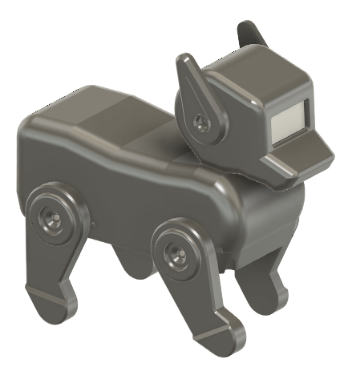
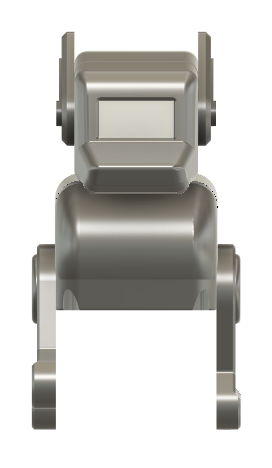
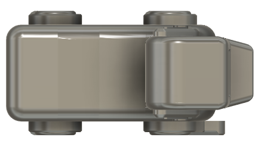

# UNIT Pulsar Pet Robot

**DIY Open-Source Quadruped Robot — powered by ESP32-C6 and 3D Printing.**

The **UNIT Pulsar Pet Robot** is an open-source quadruped robot designed as a desktop companion toy with basic interactive functions. It is accessible, modular, and easy to assemble using 3D-printed parts and commercially available electronic components. It is intended for beginners and makers learning robotics, embedded programming, and 3D printing through a fun and approachable platform.

  
  
<em>UNIT Pulsar Pet Robot — Isometric View</em>

## Quick Links

## Specifications

| Component         | Details                                                    |
|-------------------|------------------------------------------------------------|
| Microcontroller   | ESP32-C6                                                   |
| Display           | OLED                                                       |
| Actuators         | 12x SG90 Servo Motors                                      |
| Connectivity      | Wi-Fi 6 / Bluetooth 5 / QWIIC ecosystem                    |
| Mechanical        | 3D-printable chassis (quadruped, modular)                  |
| Development       | Arduino IDE · ESP-IDF · MicroPython                        |

## Highlights

| Feature | Description |
| :--- | :--- |
| Quadruped design | 12 SG90 servos for natural motion |
| Modular hardware | Easy to upgrade or repair |
| Low cost | Built with widely available parts |
| Open source | Hardware, firmware, and documentation |
| 3D printable | Manufacturable at home |
| OLED interface | Integrated visual feedback |
| QWIIC ecosystem | Simplified wiring |

## Gallery

<table>
<tr>
<td align="center"></td>
<td align="center"></td>
<td align="center"></td>
</tr>
<tr>
<td align="center"><b>Isometric</b></td>
<td align="center"><b>Front</b></td>
<td align="center"><b>Top</b></td>
</tr>
</table>

## 📝 License

Licensed under the **MIT License**. See [`LICENSE.md`](LICENSE.md) for details.

  Created by UNIT Electronics

