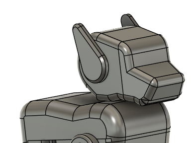

# Pulsar Pet Robot Kit

A modular development kit for creating interactive desk pet projects using the ESP32-C6 microcontroller, OLED display, and servo motors. Designed for easy customization, this kit is suitable for both beginners and experienced makers.

  
  
<em>Development Kit Overview</em>

## Quick Links

## Specifications

| Component         | Details                                                    |
|-------------------|------------------------------------------------------------|
| Microcontroller   | ESP32-C6                                                   |
| Display           | OLED                                                       |
| Actuators         | 4x Servo Motors                                            |

## Documentation

- [Schematic Diagram](#)
- [Pinout Diagram](#)
- [Getting Started Guide](#)

## 📝 License

Licensed under the **MIT License**. See [`LICENSE.md`](LICENSE.md) for details.

  Created by UNIT Electronics

